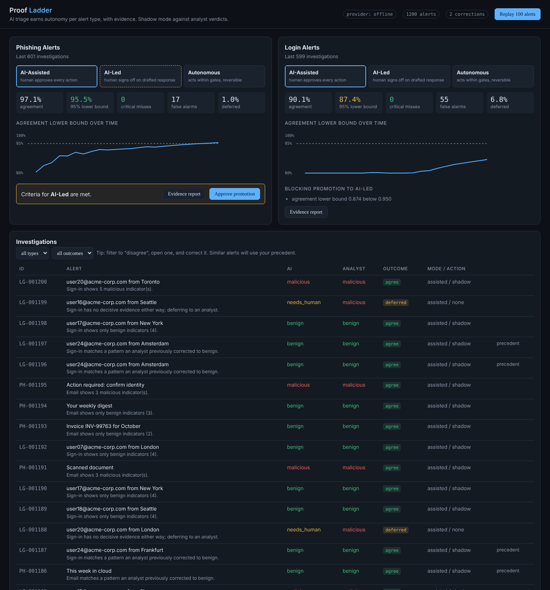

# Proof Ladder

**Evidence-gated autonomy for an agentic SOC triage agent.**

An AI analyst triages security alerts in shadow mode, every verdict is graded by its evidence, its decisions are scored against human analysts per alert type, and it earns more autonomy only when the data proves it is safe. Analyst corrections are remembered and become permanent regression tests.



## The problem

AI SOC platforms can investigate every alert, but customers rarely let them act on their own:

- Only 37% of practitioners say they trust AI in the SOC, and automated incident response sits at 39% adoption (SANS 2026 AI Survey).
- 9 in 10 security leaders need to see how AI reaches its decisions before trusting it, and analysts spend 8.6 hours a week overseeing AI output (Torq 2026 AI SOC Leadership Report, 450 leaders).
- Practitioners describe "pilot purgatory": AI handles enrichment and summaries, humans keep decision authority, and expansion into higher-stakes work never follows (Help Net Security, March 2026).

Moving a workflow from "AI suggests" to "AI acts" is usually a gut-feel decision. Proof Ladder turns it into a measured, auditable promotion.

## How it works

```
Alert replayer (simulated SIEM feed)
  -> Triage agent: one bounded tool-use loop (step, cost and tool-scope limits)
  -> Verdict with findings graded Confirmed / Inferred / Gap, enforced by software
  -> Shadow comparator: AI verdict vs analyst verdict
  -> Trust ladder: per-alert-type metrics -> recommend promotion / auto-demote
  -> Dashboard + one ordered audit trail per investigation
Analyst correction -> corrections memory (vector search) + regression case -> CI eval gate
```

**1. Bounded triage agent.** One reasoning loop, not a mesh of agents, so there is one audit trail to read. Hard limits on tool calls and spend; tools are scoped per alert type and arguments are validated. Provider errors and budget overruns fail safe to `needs_human`, never fail open.

**2. Evidence grading, enforced after the model answers.**
- `confirmed` must cite audit steps that are successful tool calls, otherwise it is downgraded to `inferred` and logged as a violation.
- `inferred` must include reasoning.
- `gap` means "looked, found nothing", stated instead of guessed.
- A `malicious` or `benign` verdict needs at least one confirmed finding supporting it, otherwise it becomes `needs_human`. A benign verdict that contradicts confirmed malicious evidence also defers.

**3. Trust ladder.** Three levels per alert type: AI-Assisted (human approves every action), AI-Led (human signs off on a drafted response), Autonomous (acts within gates). Promotion requires, over the last 1,000 investigations:

| Criterion | AI-Led | Autonomous |
|---|---|---|
| Decided alerts | 200 | 500 |
| Agreement, 95% Wilson lower bound | 95% | 98% |
| Critical misses (threat called benign) | 0 | 0 |
| Deferral rate | at most 20% | at most 10% |

The **lower bound** is used instead of raw accuracy because 98% on 50 alerts and 98% on 2,000 alerts are very different claims. Promotions are *recommended* with an evidence report and require human approval. Demotions are *automatic*, immediately on a critical miss, or when metrics fall 2 points below the bar.

**4. Corrections memory and regression gate.** When an analyst corrects a verdict, the alert's deterministic feature signature is stored in a vector index (in-process or Qdrant). Future alerts with the same pattern retrieve it as cited precedent. Every correction is also exported to `tests/regression/cases.jsonl`, and CI fails if any previously fixed mistake comes back. A test also checks that precedent does not over-generalize: an attacker on the same corporate VPN but with a new device and MFA push fatigue is still called malicious.

## Results on the synthetic data

Two alert types, each with realistic traps built in: young click-tracking domains on legitimate newsletters, compromised vendor mailboxes that pass SPF/DKIM, corporate VPN egress that looks like impossible travel, and session-token replay through residential proxies.

Shadow replay of 1,200 alerts with the built-in reasoner, before and after **one** analyst correction per blind spot:

| | Phishing | Logins |
|---|---|---|
| Agreement before corrections (first 800 alerts) | 95.7% (LB 93.3%) | 85.1% (LB 81.0%) |
| Critical misses | 0 | 0 |
| After 1 correction each + 400 more alerts | 97.1% (LB 95.5%) | 90.1% (LB 87.4%) |
| Ladder outcome | **AI-Led recommended** | Still blocked: must rebuild clean history |
| Holdout eval (600 fresh alerts, with memory) | 100% | 100% |

Token-replay logins are deferred to analysts (about 7% of logins) because the agent has no confirmed evidence either way. That is the intended behaviour: it says "Gap" instead of guessing.

## Run it

```bash
make install          # python3 -m venv .venv && pip install -r requirements-dev.txt
make demo             # fresh DB, 800 alerts, analyst corrections, regression export, 400 more alerts
make run              # http://localhost:8080
make test             # 19 tests incl. regression suite and mocked LLM providers
make eval             # holdout evaluation gate, writes eval/report.json
```

Or the full stack (API + Postgres + Qdrant, live alert feed): `docker compose up --build`.

**Demo script (2 minutes):** open the dashboard, filter Investigations to `disagree`, open a corporate VPN login, read its graded findings and audit trail, correct it to benign with a note, click *Replay 100 alerts*, watch the same pattern now resolve with `precedent`, then open the phishing *Evidence report* and approve the promotion to AI-Led.

## Use a real LLM

The built-in offline reasoner is deterministic so CI needs no API key. Switch providers with environment variables (see `.env.example`):

```bash
# Anthropic Messages API
LLM_PROVIDER=anthropic LLM_MODEL=<model-id> LLM_API_KEY=... make run
# Any OpenAI-compatible endpoint: OpenAI, Gemini (OpenAI-compatible endpoint), Ollama
LLM_PROVIDER=openai LLM_BASE_URL=http://localhost:11434/v1 LLM_MODEL=llama3.1 make run
```

Set `LLM_PRICE_IN_PER_MTOK` / `LLM_PRICE_OUT_PER_MTOK` to track cost per alert. The same grading rules, budgets and ladder apply to every provider, and `eval.run_eval` can gate a real model in CI when `LLM_API_KEY` is set as a repo secret.

## Deploy (Google Cloud Run)

```bash
GCP_PROJECT=my-project bash deploy/cloudrun.sh
```

Builds from the Dockerfile and seeds 600 alerts on start. By default it scales to zero when idle (low cost) and demo data resets on each restart; `ALWAYS_ON=true` keeps a warm instance with a live alert feed. Step-by-step first-time setup is in [docs/DEPLOY.md](docs/DEPLOY.md). SQLite in `/tmp` by default; set `DATABASE_URL` (Cloud SQL or Neon Postgres) and `QDRANT_URL` (Qdrant Cloud) for persistence. Put API keys in Secret Manager. Set `READONLY=true` for a public demo. The GitHub Actions workflow runs tests and the eval gate on every push and deploys `main` when `GCP_PROJECT`, `GCP_WIF_PROVIDER` and `GCP_DEPLOY_SA` repo variables are set.

## Project layout

```
app/agent/      tools, bounded executor, offline reasoner, LLM providers, grading enforcement
app/data/       synthetic phishing and login generators with ground truth
app/ladder/     Wilson bound, promotion / demotion engine
app/memory/     corrections memory (local or Qdrant)
app/pipeline.py ingest, triage, shadow compare, corrections, regression export
app/main.py     FastAPI + dashboard (app/static)
eval/           holdout evaluation gate and thresholds
tests/          unit, API, provider and regression tests
```

## Limitations

- Ground-truth labels stand in for analyst verdicts. A real deployment would score against actual analyst decisions, which are themselves noisy, so agreement would be measured against analyst consensus or second review.
- Data and threat intel are synthetic. The generators are designed around real SOC patterns, but production alerts are messier.
- Signature hashing makes precedent matching exact-pattern and conservative by design. A learned embedding would generalize further and would need its own over-generalization tests.
- Autonomous actions are mocked (`executed` status). Real response actions need reversibility and approval gates per action type.

Inspired by the autonomy-trust gap in agentic SOC platforms. Not affiliated with any vendor.

### Sources
- [SANS 2026 AI Survey, via Swimlane](https://swimlane.com/blog/sans-ai-2026-soc-trust/)
- [Torq 2026 AI SOC Leadership Report](https://torq.io/?p=14271)
- [Help Net Security: AI SOC vendors are selling a future production deployments haven't reached](https://www.helpnetsecurity.com/2026/03/26/future-ai-soc-vendor-claims/)
